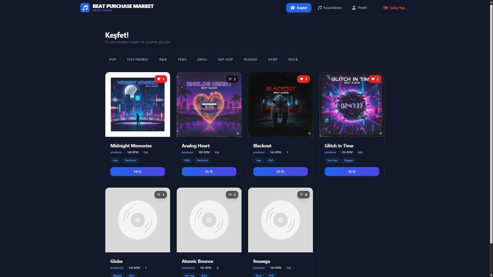
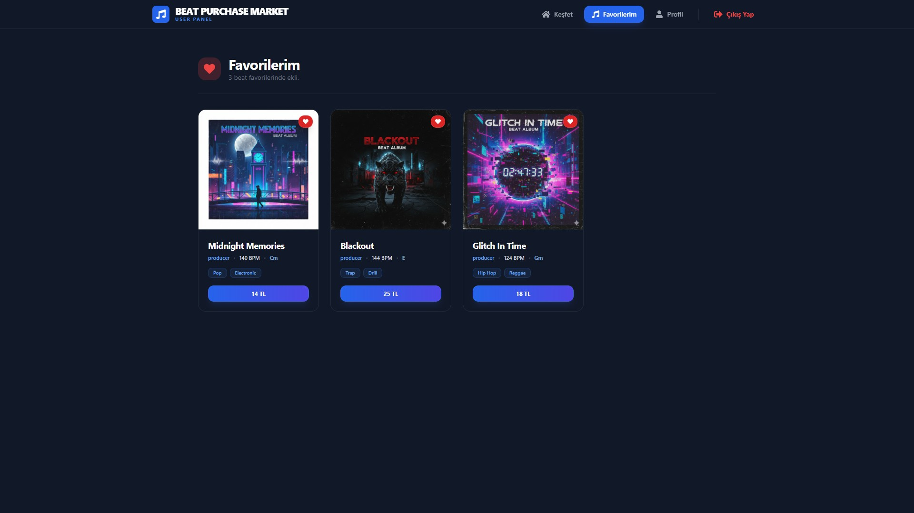
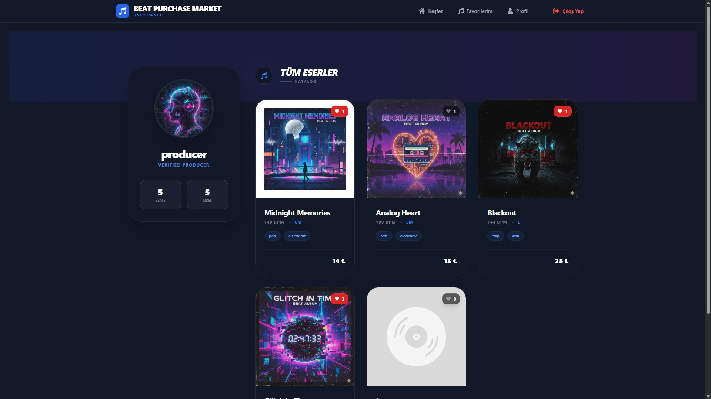
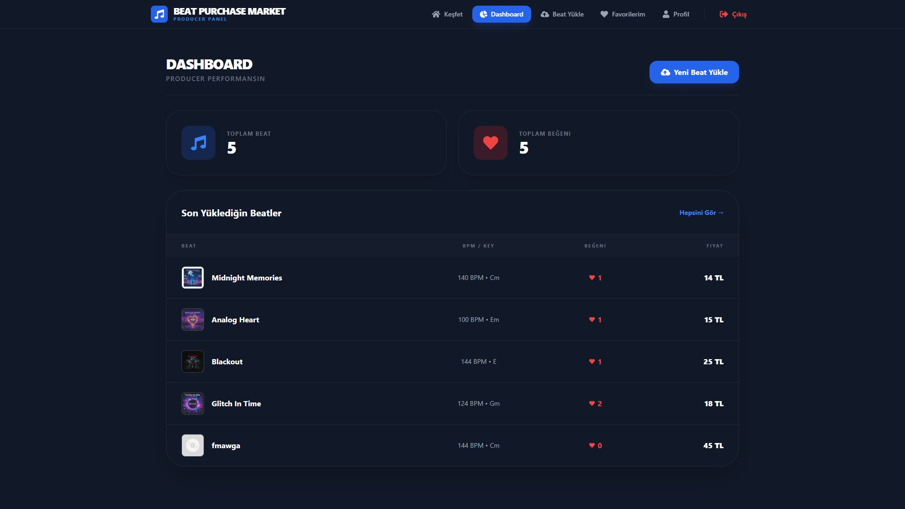
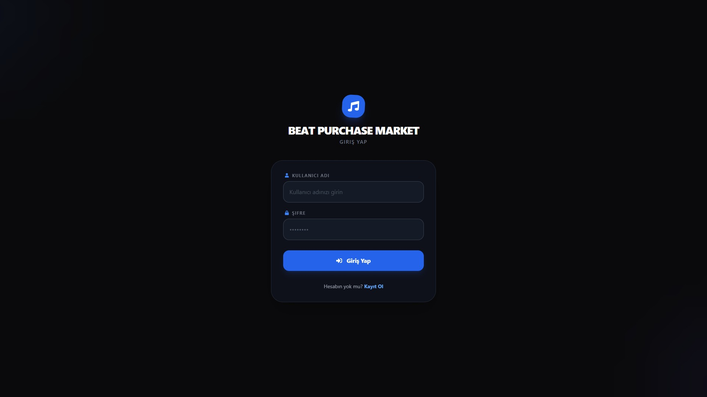
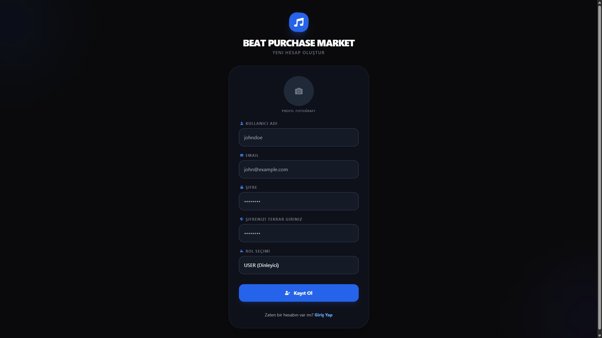
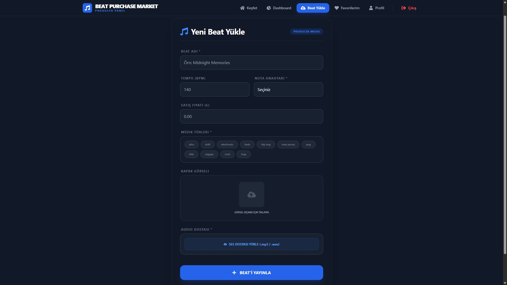
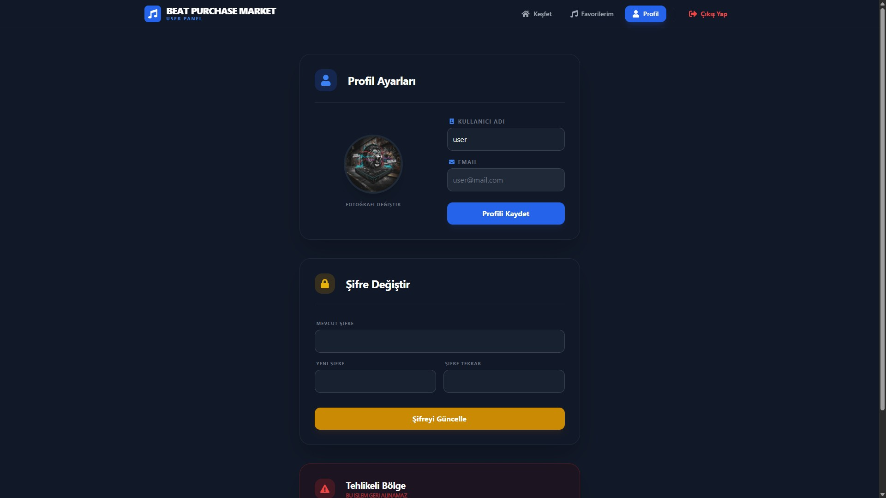
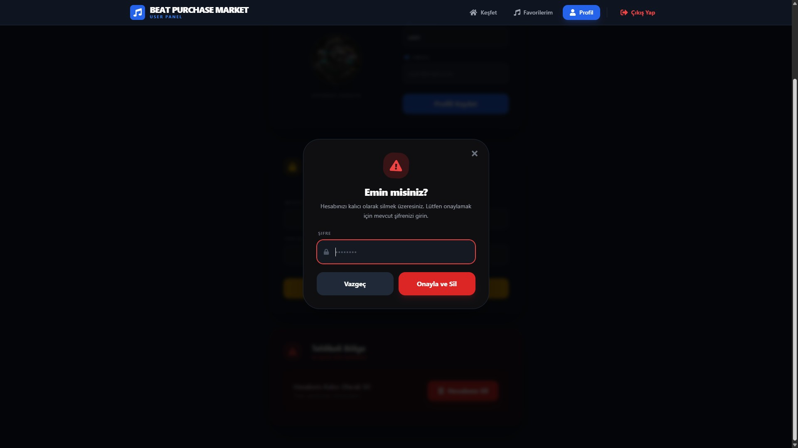

# Beat Purchase Market

Beat Purchase Market, full-stack bir web yazılımı geliştirme sürecini deneyimlemek, modern mimari kalıplarını uygulamak ve backend, frontend ile ilişkisel veritabanı bileşenlerinin entegrasyonunu sağlamak amacıyla geliştirilmiş modern bir müzik pazaryeri platformudur.

Proje; yapımcıların (producer) kendi müzik eserlerini (beat) detaylı metadataları ile yükleyebildiği, yönetebildiği ve performanslarını takip edebildiği, dinleyicilerin (user) ise müzik türlerine göre keşif yapıp favori listelerini oluşturabildiği iki farklı rol tabanlı ekosistem üzerine kurulmuştur.

---

## 🚀 Öne Çıkan Özellikler

### 🔐 Kimlik Doğrulama & Kullanıcı Yönetimi

- **Rol Tabanlı Kayıt Sistemi:** Kullanıcılar sisteme `USER` (Dinleyici) veya `PRODUCER` (Yapımcı) olarak kaydolabilirler. Kayıt esnasında profil fotoğrafı yüklenebilir.
- **Güvenli Kimlik Doğrulama:** Şifreler `bcrypt` ile hash'lenerek MSSQL üzerinde saklanır. Oturum yönetimi `Passport-JWT` stratejisi ile korunur.
- **Esnek Profil Yönetimi:** Kullanıcılar e-posta adresleri hariç kullanıcı adı ve profil fotoğraflarını güncelleyebilirler.
- **Katmanlı Güvenlik Kontrolleri:** Şifre güncelleme işlemi eski şifre doğrulaması gerektirir. Hesap silme işlemi ise iki aşamalı bir uyarı modali üzerinden, güncel şifrenin tekrar girilmesi şartıyla güvenli bir şekilde gerçekleştirilir.

### 🎧 Dinleyici (User) Deneyimi

- **Keşfet Dünyası:** Ana sayfada sistemdeki tüm beat'ler listelenir. Kullanıcılar beat'lerin yapımcı profillerine erişebilir.
- **Gelişmiş Filtreleme:** Müzik eserleri, dinamik olarak veritabanından çekilen müzik türlerine (`Genre`) göre anlık olarak filtrelenebilir.
- **Merkezi Ses Oynatıcı:** Arka planda ses senkronizasyonu bozulmadan parçalar oynatılabilir, duraklatılabilir ve parçalar arası geçiş yapılabilir.
- **Favori Yönetimi:** Arayüzde optimistic update (anlık güncelleme) mimarisiyle beat'ler favorilere eklenebilir veya kaldırılabilir. Özel "Favorilerim" sayfasından sadece seçilen beat'ler yönetilebilir.

### 📊 Yapımcı (Producer) Stüdyosu

- **Dashboard (Performans Paneli):** Üreticiler toplam yükledikleri beat sayısını ve eserlerinin tüm kullanıcılar tarafından aldığı toplam favori (beğeni) sayısını tek bir panelden izleyebilir.
- **Gelişmiş Beat Yükleme:** Dosya boyutu ve MIME-type filtrelerinden geçen `.mp3` ses dosyaları, kapak görselleri, BPM, Nota Anahtarı (Key), Fiyat ve Çoklu Tür (Genre) seçimiyle sisteme yüklenebilir.
- **Edit & Delete Studio:** Yapımcılar sadece kendi yükledikleri beat'leri modallar üzerinden güncelleyebilir, dosya sisteminden ve veritabanından kalıcı olarak silebilirler.

---

## 🛠️ Kullanılan Teknolojiler

### Backend

- **Framework:** NestJS
- **ORM:** TypeORM
- **Güvenlik:** `passport-jwt`, `bcrypt`
- **Dosya Yönetimi:** `multer` (diskStorage ve fileFilter entegrasyonu)

### Frontend

- **Kütüphane & Araçlar:** React, Vite, TypeScript
- **Durum Yönetimi:** React Context API (`AuthContext`, `AudioContext`, `LoggedInUserContext`)
- **Stil Yönetimi:** Tailwind CSS
- **İletişim:** Axios

### Veritabanı

- **Sistem:** Microsoft SQL Server (MSSQL)
- **Yönetim Paneli:** SQL Server Management Studio (SSMS)

---

## 📸 Ekran Görüntüleri

_Projenin görsel arayüzüne ait ekran görüntülerini aşağıda inceleyebilirsiniz:_

#### 🏠 Ana Sayfa



#### ❤️ Favoriler



#### 🪪 Producer Profile



#### 📊 Producer Dashboard



#### 🔐 Login / Register




#### 🎵 Beat Yükleme Sayfası



#### 👤 Profil ve Güvenlik Ayarları




---

## ⚙️ Kurulum ve Yapılandırma

### Gereksinimler

- Node.js (v18 veya üzeri)
- Microsoft SQL Server (MSSQL) & SSMS

### 1. Veritabanı Hazırlığı

SQL Server Management Studio (SSMS) panelinizi açın ve projeniz için yeni bir veritabanı oluşturun:

```sql
CREATE DATABASE BPMDB;
```

### 2. Çevre Değişkenlerinin Ayarlanması

Backend ve Frontend klasörlerinizin kök dizinlerinde sırasıyla `.env` dosyaları oluşturun ve aşağıdaki değişkenleri kendi yerel ortamınıza göre doldurun:

#### 📁 Backend `.env` Yapılandırması:

```bash
# Veritabanı Ayarları
DB_HOST=localhost
DB_PORT=1433
DB_USERNAME=your_mssql_username
DB_PASSWORD=your_mssql_password
DB_NAME=BPMDB

# JWT Ayarları
JWT_SECRET=projeniz_icin_olusturulmus_cok_guvenli_gizli_anahtar

# Uygulama Ayarları
PORT=3000
FRONTEND_URL=http://localhost:5173
```

#### 📁 Frontend `.env` Yapılandırması:

```bash
VITE_API_URL=http://localhost:3000
```

### 3. Projenin Çalıştırılması

#### 🟢 Backend Başlatma:

```bash
cd backend
npm install
npm run start:dev
```

#### 🔵 Frontend Başlatma:

```bash
cd frontend
npm install
npm run dev
```

Uygulama başarıyla ayağa kalktığında tarayıcınızdan http://localhost:5173 adresine giderek platformu deneyimleyebilirsiniz.

## 📄 Lisans

Bu proje, açık kaynak topluluğuna katkı sağlamak amacıyla MIT Lisansı altında lisanslanmıştır. Dilediğiniz gibi inceleyebilir, fork edebilir ve kendi projelerinizde kaynak göstererek kullanabilirsiniz.

_Bartu Sarı_
